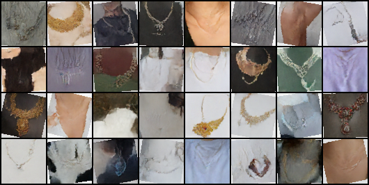

# The Necklace Design Generator

A small DDPM diffusion model that learns the distribution of necklace product
photos and generates new designs from pure Gaussian noise.



*32 samples drawn from the trained DDPM-64 via 250-step DDIM with EMA weights.
Several cells show clear gold pendants, chain shapes, and necklace-on-skin/cloth
compositions, all generated from random noise — no real images involved.*

## What this project does

We train a **denoising diffusion probabilistic model** (DDPM) on a small
collection of 64×64 necklace photos. At inference we sample pure Gaussian noise
and iteratively denoise it through the trained UNet to recover an image that
looks like a necklace.

This works on a tiny dataset (~470 images) because:

- The DDPM training objective gives the model *thousands* of training signals
  per image — every random `(t, noise)` pair is a fresh learning target.
- A cosine noise schedule + min-SNR-γ loss weighting keep the gradient signal
  meaningful at every noise level.
- Heavy data augmentation (random resized crops, flips, rotations, color
  jitter) effectively multiplies the dataset size during training.
- Sampling uses an **exponential moving average** of the model's weights, which
  is consistently sharper than the live weights for diffusion.

## Quickstart

```bash
# 1. Install deps (Python 3.10+).
pip install torch torchvision pillow numpy

# 2. Get data — drop necklace images into data/necklaces/. We used
#    Kaggle's Fashion Product Images (Small) filtered to articleType=='Necklace'.
mkdir -p data/necklaces

# 3. Train + sample (~3-4 hrs on Apple Silicon).
python train.py --epochs 3000

# 4. Generate more samples from a saved checkpoint.
python sample.py --ckpt checkpoints/ddpm_unet_b64_ep3000.pt --n-samples 32 --sample-steps 250
```

Auto-detects Apple Silicon (`mps`), CUDA, or CPU.

## Architecture

A compact U-shaped convolutional network with self-attention at the bottleneck:

```
        x_t (3 × 64 × 64)                        ε̂ (3 × 64 × 64)
              │                                       ▲
              ▼                                       │
        in_conv  (64ch)                          out_conv
              │                                       ▲
        ┌── ResBlock ──┐ ────── skip ───────► ┌── ResBlock ──┐
        │   (64ch)     │       64×64          │   (64ch)     │
        └──────┬───────┘                      └──────▲───────┘
               ▼                                     │
            Conv↓ 2×                              ConvTranspose↑ 2×
               │                                     │
        ┌── ResBlock ──┐ ────── skip ───────► ┌── ResBlock ──┐
        │   (128ch)    │       32×32          │   (128ch)    │
        └──────┬───────┘                      └──────▲───────┘
               ▼                                     │
            Conv↓ 2×                              ConvTranspose↑ 2×
               │                                     │
        ┌── ResBlock ──┐ ────── skip ───────► ┌── ResBlock ──┐
        │   (256ch)    │       16×16          │   (256ch)    │
        └──────┬───────┘                      └──────▲───────┘
               ▼                                     │
            Conv↓ 2×                              ConvTranspose↑ 2×
               │                                     │
        ┌── ResBlock ──┐                      ┌── ResBlock ──┐
        │   (256ch)    │                      │   (256ch)    │
        └──────┬───────┘                      └──────▲───────┘
               ▼                                     │
        Self-Attention (heads=4)                     │
               │           8×8                       │
               ▼                                     │
        ┌── ResBlock ──┐ ──────────────────────────► │
        │   (256ch)    │                             │
        └──────────────┘                             │

       (timestep t) ──► sinusoidal embed ──► MLP ──► added inside every ResBlock
```

Total parameters: **~11M** (at `base=64`). Implemented in [models.py](models.py).

**Why this shape:** the encoder compresses the noisy image to an 8×8 spatial
grid where one self-attention layer can mix information across the whole
image. The decoder mirrors the encoder, with skip connections so the high-res
output can recover fine detail that the bottleneck would otherwise discard.
Timestep conditioning is injected into every ResBlock so the network knows how
much noise to remove.

## Loss function

We train the UNet to predict the noise `ε` that was added to a clean image at a
random timestep. The forward diffusion process from
[diffusion.py](diffusion.py) is:

```
x_t = √(ᾱ_t) · x_0 + √(1 - ᾱ_t) · ε,   ε ~ N(0, I)
```

where `ᾱ_t` is the cumulative product of `(1 - β_t)` along a **cosine
schedule**. At `t=0` the image is clean; at `t=T` it's
pure Gaussian noise.

The loss is mean-squared error between the predicted and true noise, weighted
by **min-SNR-γ**:

```
L = E_t [ w(t) · ‖ ε - ε̂_θ(x_t, t) ‖² ]
where  w(t) = min(SNR_t, γ) / SNR_t,   SNR_t = ᾱ_t / (1 - ᾱ_t)
```

Without weighting, low-noise (high-SNR) timesteps dominate the gradient because
the loss surface there is much sharper. Min-SNR caps `w(t)` at low-noise
timesteps and leaves it at 1 for high-noise timesteps, balancing learning
across the schedule. With γ=5: weight ≈ 0.0005 at t=0, ≈ 0.15 at t=100,
= 1.0 for t ≥ 500.

## Training process

```
for each epoch:
    for each batch x_0 from the loader:
        x_0 ← x_0 ∈ [-1, 1]                            # rescale from [0,1]
        t ~ Uniform{0, ..., T-1}                       # random timestep per sample
        ε ~ N(0, I)
        x_t ← √(ᾱ_t) · x_0 + √(1 - ᾱ_t) · ε           # forward noise
        ε̂ ← UNet(x_t, t)                              # predict noise
        L ← min-SNR-γ MSE(ε, ε̂)
        backprop, clip grads to 1.0, Adam step
        update EMA shadow weights
```

Final config (3000 epochs):

| | |
|---|---|
| Image size | 64×64 RGB |
| Batch size | 64 (drop_last) |
| Optimizer | Adam, lr 2e-4 |
| Diffusion timesteps T | 1000 |
| Schedule | cosine (s=0.008) |
| Min-SNR γ | 5.0 |
| EMA decay | 0.999 |
| Gradient clip | 1.0 |
| DDIM sampling steps | 250 |

## Sampling

We use **DDIM**, a deterministic sampler that walks back
through `steps` ≪ T points on the noise schedule. With `eta=0` and 250 steps
(out of T=1000), sampling is fast and has comparable quality to the full
1000-step DDPM ancestral chain. Sampling always uses the **EMA shadow weights**,
not the live training weights.

## Results

The samples at the top of this README come from the final 3000-epoch model
(~21k gradient updates). What worked:

- **Global structure is recovered.** Most samples show a clearly identifiable
  neck/torso silhouette with a chain or pendant.
- **Style variety.** Gold collar designs, dark stones, simple thin chains, and
  necklaces against skin/cloth all appear in the same batch — the model didn't
  collapse to one mode.
- **Color and lighting.** Backgrounds vary realistically; the model learned that
  necklaces appear against many different skin tones and cloth backgrounds.

What's still imperfect:

- **Fine pendant detail** is sometimes painterly rather than crisp. With ~470
  training images, individual pendant designs are too rare for the model to
  reproduce exactly.
- **A few cells degrade to abstract textures.** This is expected at this dataset
  size — diffusion typically wants ≥10× the data we have.

## Repo layout

- [train.py](train.py) — CLI entry point: trains then samples
- [sample.py](sample.py) — CLI entry point: load a checkpoint and sample
- [models.py](models.py) — UNet + ResBlock + SelfAttention + sinusoidal timestep embed
- [diffusion.py](diffusion.py) — `GaussianDiffusion` (cosine schedule + DDIM sampler) + `EMA`
- [data.py](data.py) — `NecklaceDataset` with augmentation pipeline
- [utils.py](utils.py) — device picking, seeding, image-grid saving
- `data/necklaces/` — input images (gitignored)
- `checkpoints/` — saved model weights (gitignored)
- `outputs/` — sample grids
